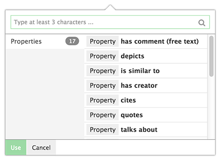
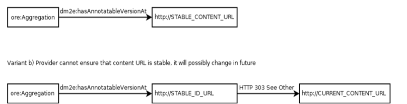
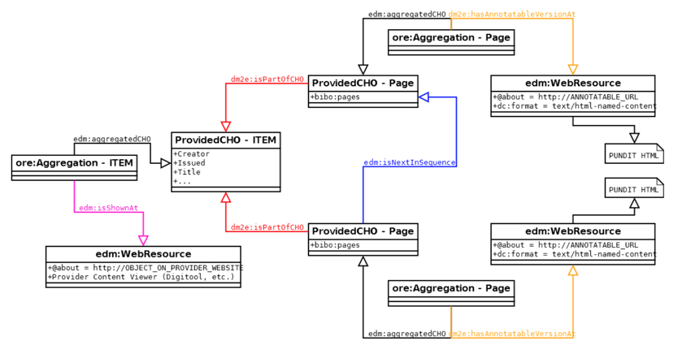
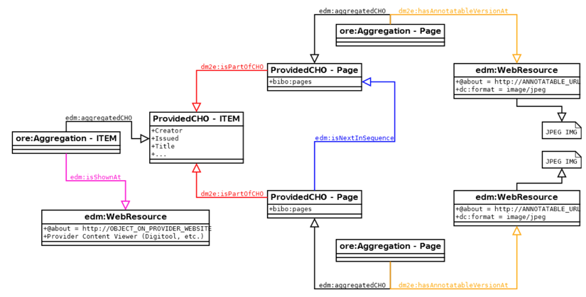

#{{ page.title }}

## 1. Setup the client

You can use the **Pundit client** by installing it on your webpages.

Create a configuration file (**e.g.: pundit-conf.js**) and include it before calling Pundit initialization commands.
The configuration file can be anywhere, with the name you prefer.

Then include something like this somewhere in your page:

    

    <link rel="stylesheet" href="http://dev.thepund.it/download/client/last-beta/pundit2.css" type="text/css">
    
    
    

### 1.1 Configure it

To overwrite Pundit’s defaults just edit the configuration file included in the page.

Using javascript syntax create an object called **"punditConfig"** and set the desired properties:

    var punditConfig = {
        debugAllModules: true,
        useBasicRelations: false,
        vocabularies: [
            'http://my_site.com/my_taxonomy.jsonp'
        ],
    }

The guidelines for creating a Pundit configuration file can be found <a href="http://dev.thepund.it/download/client/last-beta/docs/index.html#!/api/punditConfig" target="_blank">here</a>.

### 1.2 Relations vocabulary

A relations set is a vocabulary of type **"predicates"**, it is similar to a taxonomy,
but items are expected to have the **“rdftype”** attribute equal to **rdf:Property**.
Specifies relations vocabularies that will be available to Pundit users
(defines a list of relations with domain and ranges).
Each vocabulary definition is a JSONP file available on the Web and is loaded by resolving an absolute URL.
The following code (see pundit 2.0 configuration (NOTE:  http://dev.thepund.it/download/client/last-beta/docs/index.html#!/api/punditConfig/object/vocabularies)) shows an example.

    result: {
         items: [
             "value": "http://purl.org/dc/terms/creator",
             "rdftype":["http://www.w3.org/1999/02/22-rdf-syntax-ns#Property"],
             "label":"has creator",
             "description":"The selected text fragment has been created by a specific Person",
             "domain":[
                 "http://xmlns.com/foaf/0.1/Image",
                 "http://purl.org/pundit/ont/ao#fragment-image",
                 "http://purl.org/pundit/ont/ao#fragment-text"
              ],
              "range":[
                 "http://dbpedia.org/ontology/Person",
                 "http://xmlns.com/foaf/0.1/Person",
                 "http://www.freebase.com/schema/people/person"
              ],
            ...other items...
             ]
        }
    }

The Relation vocabulary is then used by the Pundit Client in the **Resource Panel** to show the predicates
available to the user to build triples.

---

## 2. HTML pages requirements

Since the original Pundit requirements expect **HTML as "container" for annotatable content**,
providers would have to provide their content accordingly in order to be able to have it available to
scholars working with Pundit. As it cannot be expected that every provider will be able to meet these
requirements, alternative means of providing content are offered in this section.

### 2.1 Requirements

Provided content is annotatable if:

1. It is reachable at a stable URL, that we **call annotatable URL**.

2. It is available in one of the following forms:

* As **HTML** containing the following markup (See Section 2.2.1):

        

        <!--
        An HMTL to be annotated
        This can contain text as well as images
        See https://doc.dm2e.huberlin.de/redmine/projects/wp3/wiki/Named_content_markup
        -->
        

    The **content URI** is a stable URI that serves as unique identifier for one content segment.
    The granularity of the annotable content should be decided by the content provider, but it should be at least on page level in order to be useful.
    The HTML named contents can, however, be further nested below page level (See https://doc.dm2e.huberlin.de/redmine/projects/wp3/wiki/Named_content_markup)

* As an **image file** of a format that can be displayed in a Web Browser (JPG, PNG) under a stable URL (See Section 2.2.2)

* As **plain text file** under a stable URL (See Section 2.2.2)

We strongly encourage the **content URI** to be an URL and to be dereferenceable to the same HTML representation as shown above.
In other words: **The content URI can be equal to the annotatable URL.** It must be ensured that the **annotatable URL is always stable
and will not change in future**. If this is not the case, providers should implement "generic"
stable URLs serving as stable IDs, redirecting to the actual content via HTTP 303.
This can be easily implemented by using e.g. Rewrite Rules in Apache1.

### 2.2 Interplay between metadata and provided content

Usually, every annotatable URI corresponds to one provided Cultural Heritage Object (CHO) that is linked to other CHOs,
e.g., a CHO representing a single digitised page image and a CHO that represents the manuscript.
The annotatable URI has to be linked from the metadata of the corresponding CHO using **dm2e:hasAnnotatableVersionAt**.

There will be three different options for providers to provide their content to DM2E.
Two of these options will enable annotation through Pundit, while the third option will only cover the
ingestion into Europeana and the ability of Europeana users to view the provided content on the provider’s Website.

The main difference between options 1 and 2 is that the former reflects the "original" specification of
providing content to Pundit while the latter loosens this requirement such that it
will not be strictly necessary to provide content in the form of HTML anymore,
but rather be able to provide “raw” content such as digitised pages or plain text instead.

Nevertheless, **each annotatable segment of content has to be identified and retrieved via a stable
URL maintained by content providers. This is a very strict requirement for the content to be usable in
WP3 and in the overall project (See Figure 1).**

For options 1 and 2, the type of content (HTML, plain text or image file) will be specified as follows:

The **ore:Aggregation**’s property **dm2e:hasAnnotatableVersionAt** links to an **edm:WebResource** within
which a property **dc:format** enables the explicit statement of the content type
<a href="http://assets.okfn.org.s3.amazonaws.com/p/dm2e/DM2E_Model_V1.0_Specification.pdf" target="_blank">http://assets.okfn.org.s3.amazonaws.com/p/dm2e/DM2E_Model_V1.0_Specification.pdf</a>

We currently allow five different statements (derived from mime-types) for the **dc:format** property of
**edm:WebResources** linked to by **dm2e:hasAnnotatableVersionAt**:

<table>
  <tr>
    <td>For HTML content as specified by pundit</td>
    <td><em>text/html-named-content</em></td>
  </tr>
  <tr>
    <td>For Plain text content</td>
    <td><em>text/plain</em></td>
  </tr>
  <tr>
    <td>For Image files</td>
    <td><em>image/gif, image/jpeg, image/png</em></td>
  </tr>
</table>

**Note:**

Since Pundit is a Web application, we can only support image formats that are widely supported by Web Browsers.
This should be the case for the formats JPEG, GIF and PNG.

#### 2.2.1 Maximum support of the Pundit annotation facilities

A content provider is strongly encouraged to provide content in a compliant HTML form in order to ensure the project
can make the best use of it. By using special HTML tags within the provided content,
Pundit can attach and display annotations at the content level rather than at the page where it is displayed in.
<a href="http://www.thepund.it/documentation/play-nice-with-pundit/" target="_blank">See this (BROKEN LINK) link</a>.

The HTML content can include a formatted text, as in the case of the Wittgenstein Brown Book
(contents that we are currently experimenting with).
An example can be <a href="http://www.wittgensteinsourcevps.org/Ms-139a,1r[2]et1v[1]et2r[1]_n.html" target="_blank">found here</a>.

It could include an image embedded in HTML, as in the following example:

[BROKEN LINK](http://furioso-dev.netseven.it/index.php/illustrazione/img/47.html)

    <html>
        <head/>
        <body>
            

                
            

        </body>
    </html>

However, multiple "pieces of contents" can be combined in the same web page, e.g. a facsimile
shown aside of its textual transcription.

This shows an example structure from the DM2E model view, where a provided item is
modeled according to the DM2E specification, featuring a **ProvidedCHO** for the item itself and "children" **ProvidedCHO**’s
for each page of the item.

For each page, a **dm2e:hasAnnotatableVersionAt** property points to a **edm:WebResource** describing the link to the HTML representation as specified in [https://doc.dm2e.huberlin.de/redmine/projects/wp3/wiki/Named_content_markup](https://doc.dm2e.huberlin.de/redmine/projects/wp3/wiki/Named_content_markup). In such a case, the property **dc:format** of the **edm:WebResource** should have the value **text/html-namedcontent**.

**General note:**

In order to be accessible through Europeana, a **link to a provider’s viewer or similar object
representation on item level must be included as well!**

**Technical note:**

Compliant HTML representations can be created with relatively small effort from existing HTML or XML
representations owned by providers. WP3 will provide help to WP1 developers to put such web services in place.

#### 2.2.2 Convenience solution minimizing resource usage by content providers

In the case provided content are images (in web compliant formats) or plain text,
a provider can decide to publish it without markup, using URLs like the following:

<a href="http://furioso-dev.netseven.it/uploads/flexip_scraps/IllustrazioneImmagineHigh-47.jpg" target="_blank">http://furioso-dev.netseven.it/uploads/flexip_scraps/IllustrazioneImmagineHigh-47.jpg</a>

The type of the annotatable URI (image, plain text) has, however, to be indicated in the
metadata statements of the respective **edm:WebResource**.
The next figure shows an example where, from the DM2E model point of view,
the metadata now points to raw content instead of the original HTML representation.
The raw content type must be stated in the **dc:format** property of the **edm:WebResource**
pointed to by **dm2e:hasAnnotatableVersionAt**.

Use one of the following content types:

<table>
  <tr>
    <td>For Plain text content</td>
    <td><em>text/plain</em></td>
  </tr>
  <tr>
    <td>For Image files</td>
    <td><em>image/gif, image/jpeg, image/png</em></td>
  </tr>
</table>

**Note:**

the stability of the URL requirement remains valid. Each provided image or freetext will have to be available on the web at a stable URL.

#### 2.2.3 No (very limited) annotation

In the case a content provider is unable to provide content on page level or implement any of
the previous options, the use of such content in the WP3 platform will be limited and
provided in a purely best-effort way.
Note that in this case the content **might not be visible within the scholarly research platform and only
be accessible through Europeana**.

Pundit includes a bookmarklet version that can be used to experiment
with annotations of generic web pages, and this will be the
only way of augmenting the content. This will, however,
**only be considered as experimental feature**.

In any case, in this variant the provided content will be modeled on item level only.

Figure 4 shows two examples that would make this scenario necessary:

1. If the content is present in a format that cannot be annotated
with Pundit, such as PDF, then the **ore:Aggregation** on item level
should point to the resource by using **edm:isShownBy**.

2. If the content is embedded in some proprietary viewer
software that cannot offer access to e.g. single pages or cannot be
extended to include Pundit-tags (e.g. Digitool or any Flash based viewer)
then the **ore:Aggregation** on item level should point to the resource by using **edm:isShownAt**.

---

## 3. Pundit ignore

Say something about pundit ignore class.